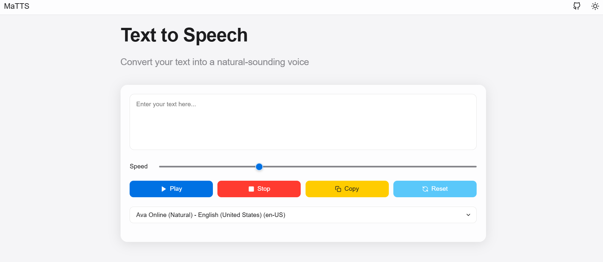

# MaTTS - Text to Speech

  <svg xmlns="http://www.w3.org/2000/svg" viewBox="0 0 512 512" width="200" height="200">
    <rect width="512" height="512" fill="#2395ff" rx="15%" ry="15%"/>
    <path fill="white" d="M156.67 128h204.67v51.2h-76.8v204.8h-51.2V179.2h-76.8V128z"/>
  </svg>

## Overview

MaTTS is a lightweight, user-friendly text-to-speech application that converts written text into natural-sounding speech. Built with modern web technologies, it offers a clean interface and high-quality voice synthesis.

## Features

- **Natural Voice Conversion**: Transform any text into realistic speech
- **Adjustable Speech Speed**: Customize the pace of voice output
- **Multiple Voice Options**: Currently supports Ava Online (Natural) with English (United States)
- **Simple Controls**: Easy-to-use play, stop, copy, and reset functions
- **Responsive Design**: Works seamlessly across desktop and mobile devices

## Demo

[Live Demo](https://texxt2speech.netlify.app)

## Screenshots

